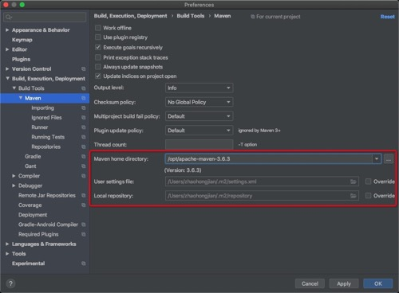
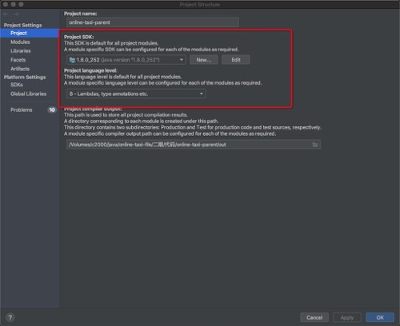

# 下载安装

# 配置maven
> 打开别人的项目未必和我们存放jar包的位置相同

preferences=> 搜索maven

1. 自己现在的maven地址，根据自己项目的需求指向不同的地方
2. 自己的setting.xml 具体的上一篇有说
3. 本地库的地址，区别于nodejs的node_modules，java的包是放在一个地方的

# 更改java的路径

file => project structrue

# bootstrap.yml 不支持的问题

这个不是默认支持 实际上依赖的是spring-cloud-commons-dependencies

引入eureka client 就会把这个包引进去 所以不用单独引入