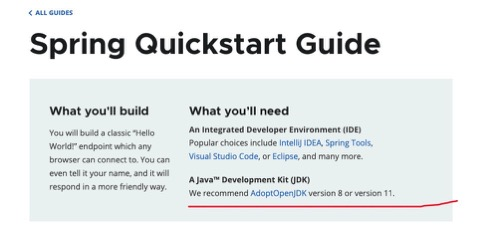
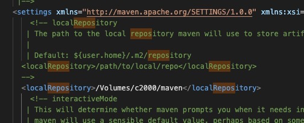

# 安装java 

大部分用的还是1.8  
java 1.8 由于协议问题 现在用 AdoptOpenJDK 理由


```
brew search adoptopenjdk
brew tap AdoptOpenJDK/openjdk
brew cask install adoptopenjdk8
```
> 出现了一个重名bug 现在要用 brew cask install homebrew/cask-versions/adoptopenjdk8
加入控制变量
```
jdk() {
        version=$1
        export JAVA_HOME=$(/usr/libexec/java_home -v"$version");
        java -version
 }
```

```
 jdk 1.8
```
具体信息 https://github.com/AdoptOpenJDK/homebrew-openjdk

# 安装maven 

> brew的 maven 里面有一个强行依赖 openjdk14  所以不用brew安装


https://maven.apache.org/install.html

1. 下载maven apache-maven-3.6.3-bin.zip

2. 解压后放到推荐的 /opt/下面

3. .bash_profile 里面添加

```
export PATH=/opt/apache-maven-3.6.3/bin:$PATH
```
4. 重启
```
source .bash_profile
```

# 全局maven配置



例如我，由于贫穷买不起高配mac 于是外挂了一个1t的固态，现在将所有的包全放到外挂硬盘上面

# 其余的settings.xml 需要自己设置
https://maven.apache.org/settings.html

```
The settings element in the settings.xml file contains elements used to define values which configure Maven execution in various ways, like the pom.xml, but should not be bundled to any specific project, or distributed to an audience. These include values such as the local repository location, alternate remote repository servers, and authentication information.

There are two locations where a settings.xml file may live:

The Maven install: ${maven.home}/conf/settings.xml
A user’s install: ${user.home}/.m2/settings.xml
```