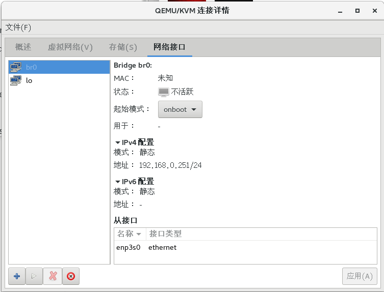

centos 7.6

```
// 图形界面
yum groupinstall "GNOME Desktop"
```
```
yum groupinstall "Virtualization Host"
```

```
// 来个gui管理界面 
yum install virt-manager -y
// applications->Sytem Tools -> virtual Machine Manager
```
```
// 开机启动

systemctl enable libvirtd
```

```
// 启动服务
systemctl start libvirtd

```

```
// 验证可用
virsh list --all
```

```
// 开机启动

systemctl enable libvirtd
```

```
// 启动服务
systemctl start libvirtd

```

```
// 验证可用
virsh list --all
```

```
// 开始使用
系统工具 -》 虚拟系统管理器
```

```
// 设置网络
// /etc/sysconfig/network-scripts/ifcfg-xxx
修改 只留下 type name uuid device onboot
添加一行
BRIDGE=br0
// vi /etc/sysconfig/network


// /etc/sysconfig/network-scripts/ 路径下

cp ./ifcfg-xxx ifcfg-br0  // 从此br0代替默认的配置作为主机配置

// 修改 br0 例如
TYPE="Bridge"
PROXY_METHOD="none"
BROWSER_ONLY="no"
BOOTPROTO="static"
DEFROUTE="yes"
IPV4_FAILURE_FATAL="no"
IPV6INIT="yes"
IPV6_AUTOCONF="yes"
IPV6_DEFROUTE="yes"
IPV6_FAILURE_FATAL="no"
IPV6_ADDR_GEN_MODE="stable-privacy"
NAME="br0"
#UUID="f7693e92-e344-402d-bdff-34c8a4a03b60"
DEVICE="br0"
ONBOOT="yes"
DNS1="114.114.114.114"
DNS2="8.8.8.8"
IPADDR="192.168.31.150"
GATEWAY="192.168.31.1"
NETMASK="255.255.255.0"
```

```
// 重启服务
systemctl restart network.service

```

### 开始图形界面操作


### 在【编辑】菜单中选择【连接详情】，打开如下窗口：选择【网络接口】这个Tab，将br0接口给停止掉，即左侧下方红色的大叉叉，注意不是圆圈的叉叉，那个是删除，此处不要删除。


### 然后选择【虚拟网络】这个Tab，将原本的一个default网络给停止并删除掉，然后重新创建一个虚拟网络，创建过程如下：


### 设置一个虚拟网络的名称，然后下一步：


### 选择转发的物理网络，此处注意是选择enpxxx 而不是br，模式采用路由的方式：


### 配置完成之后回到网络接口界面，启动br0，然后再回到虚拟网络界面，启动vnet0。

### 创建虚拟机


### 选择网络


### 不知道什么鬼
设置静态ip后 要在外面重启 不是里面命令行 例如


### docker
关于启动docker导致kvm虚拟机断网,因为主机创建了网桥br0,虚拟机的网卡是通过网桥出去的,可是为什么一启动docker会导致kvm虚拟机断网,要解释这个问题,需要先来了解一下docker的默认网络模式bridge:

当Docker server启动时，会在主机上创建一个名为docker0的虚拟网桥，此主机上启动的Docker容器会连接到这个虚拟网桥上。虚拟网桥的工作方式和物理交换机类似，这样主机上的所有容器就通过交换机连在了一个二层网络中。接下来就要为容器分配IP了，Docker会从RFC1918所定义的私有IP网段中，选择一个和宿主机不同的IP地址和子网分配给docker0，连接到docker0的容器就从这个子网中选择一个未占用的IP使用。如一般Docker会使用172.17.0.0/16这个网段，并将172.17.42.1/16分配给docker0网桥（在主机上使用ifconfig命令是可以看到docker0的，可以认为它是网桥的管理接口，在宿主机上作为一块虚拟网卡使用）。单机环境下的网络拓扑如下，主机地址为10.10.101.105/24.

借用了网络上的配图.

因为docker的网桥是通过eth0出去,可是现有的网络环境是通过网桥br0出去,所以解决这个问题,应该在/etc/docker/daemon.json(没有这个文件,直接创建)加入和重启docker:

```
{
"bridge": "br0",
"default-gateway": "192.168.80.1"<---主机的网关地址
}


```


```
// k8s 要求所有的机器不能重名
/etc/hostname 修改名字 然后reboot

```

```
普通用户使用kvm 

将用户加入分组 kvm qemu  libvirt 

不知道是哪个起了作用
```

```
// 参考文档 

https://www.cyberciti.biz/faq/how-to-install-kvm-on-centos-8-headless-server/

https://blog.csdn.net/htmlxx/article/details/105885875
```

